# TechStream — Self-Healing System

[](https://github.com/KofiAckah/Self_Healing/actions/workflows/ci.yml)
[](https://github.com/KofiAckah/Self_Healing/actions/workflows/deploy.yml)

A monitoring + automated-remediation lab that reduces Mean Time To Resolution
(MTTR): it watches the **Golden Signals**, detects an injected incident, and
**automatically heals** the service before paging an engineer. A statistical
analyzer (plus an optional LLM-powered report) performs simulated root-cause
analysis.

Built as a local Docker Compose stack running on a single EC2 instance
provisioned with Terraform, with CI on every push and zero-SSH continuous
deployment via AWS Systems Manager.

## Architecture

```
                Single EC2 (eu-west-1) running Docker Compose
┌──────────────────────────────────────────────────────────────────────────┐
│ chaos_script.py ─hits─► app (:5000) ─/metrics─► Prometheus (:9090)         │
│ (errors/latency/cpu)     • /api/data                  │ evaluate rules     │
│                          • /chaos /chaos/reset        │ error_rate > 5%    │
│ node-exporter (:9100) ───────────────────────────────┤ (1m)               │
│ cAdvisor (:8080) ─────────────────────────────────────►                   │
│                                                       ▼                    │
│                                                 AlertManager (:9093)       │
│                                                       │ bearer-token       │
│                                                       │ webhook            │
│                                                       ▼                    │
│                          docker-socket-proxy ◄─ remediation (:8081)        │
│                          (restart only)            1. POST /chaos/reset    │
│                                                    2. restart app          │
│ Grafana (:3000) ◄─query─ Prometheus    (Golden Signals dashboard)          │
│                                                                            │
│ AI analysis (on demand):                                                   │
│   root_cause_analyzer.py ─► Prometheus  (Z-score + IQR, stdlib)            │
│   analyze.py / analyze_gemini.py ─► Prometheus ─► Claude / Gemini RCA      │
└──────────────────────────────────────────────────────────────────────────┘
```

## The four lab phases

| Phase | What | Where |
|-------|------|-------|
| 1. Monitoring | Golden Signals (Latency, Traffic, Errors, Saturation) dashboarded | [monitoring/](monitoring/), [app/app.py](app/app.py) |
| 2. Anomaly injection | Chaos script: errors / latency / cpu / load / full | [chaos/chaos_script.py](chaos/chaos_script.py) |
| 3. Alerting + remediation | `HighErrorRate` (>5% for 1m) → AlertManager → auto-restart | [monitoring/prometheus/alert_rules.yml](monitoring/prometheus/alert_rules.yml), [remediation/](remediation/) |
| 4. AI analysis | Z-score + IQR analyzer (primary) + Claude / Gemini RCA (bonus) | [ai_analysis/](ai_analysis/) |

> DevOps Guru is intentionally **not** used (restricted lab account). Phase 4 is
> a self-hosted statistical analyzer plus an optional LLM-generated report.

## Golden Signal alert rules

| Signal | Metric | Threshold | For |
|--------|--------|-----------|-----|
| Errors | 5xx ratio | > 5% | 1m → **remediation** |
| Latency | P99 request duration | > 1s | 2m |
| Traffic | request rate vs 10m ago | drop > 80% | 5m |
| Saturation | host CPU | > 80% | 2m |
| Saturation | host memory | > 85% | 2m |

---

## Evidence

Screenshots and the generated RCA report live in [assets/](assets/).

### Phase 1 — Monitoring / Golden Signals

The Grafana "Observability Overview" in a healthy steady state — Requests/sec,
5xx error rate (0%), P99 latency, and application status, plus latency
percentiles and node CPU / memory / disk.

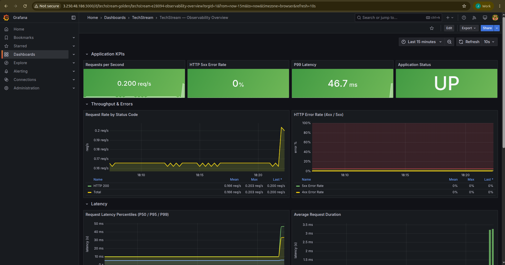

Prometheus is scraping all four targets (`techstream-app`, `node-exporter`,
`cadvisor`, `prometheus`) — all **UP**.

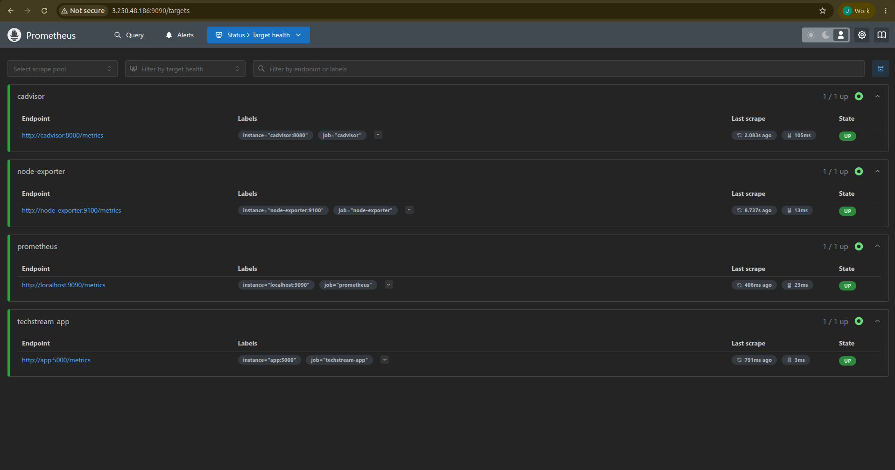

The in-app live control panel (health score, Golden-Signal cards, scrape
targets, active alerts) at `:5000`.

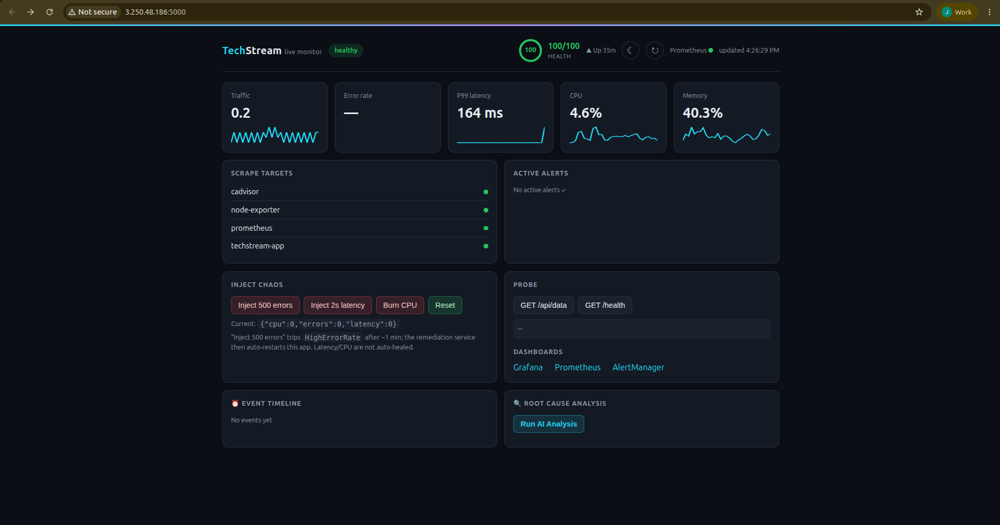

### Phase 2 — Anomaly injection (chaos)

Chaos injected from the control panel — the health score drops, the event
timeline records the injection, and CPU climbs.

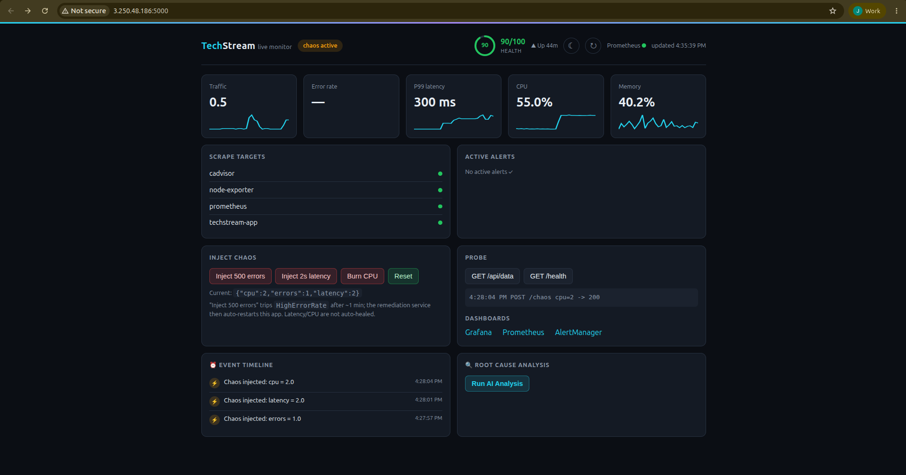

The injected faults show up in Grafana's "Chaos Injected (per mode)" panel and
the node metrics.

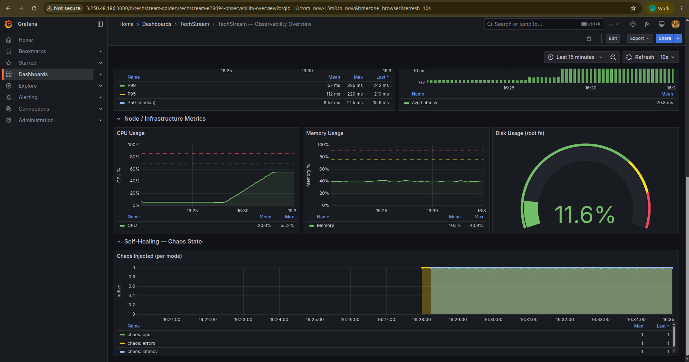

### Phase 3 — Alerting + self-healing

**Incident:** sustained 5xx traffic pushes the error-rate KPI red and the HTTP
500 series appears in "Request Rate by Status Code".

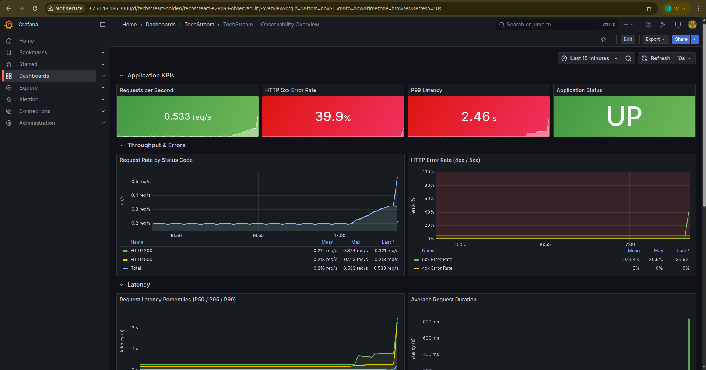

The `HighErrorRate` rule enters **PENDING** then fires in Prometheus…

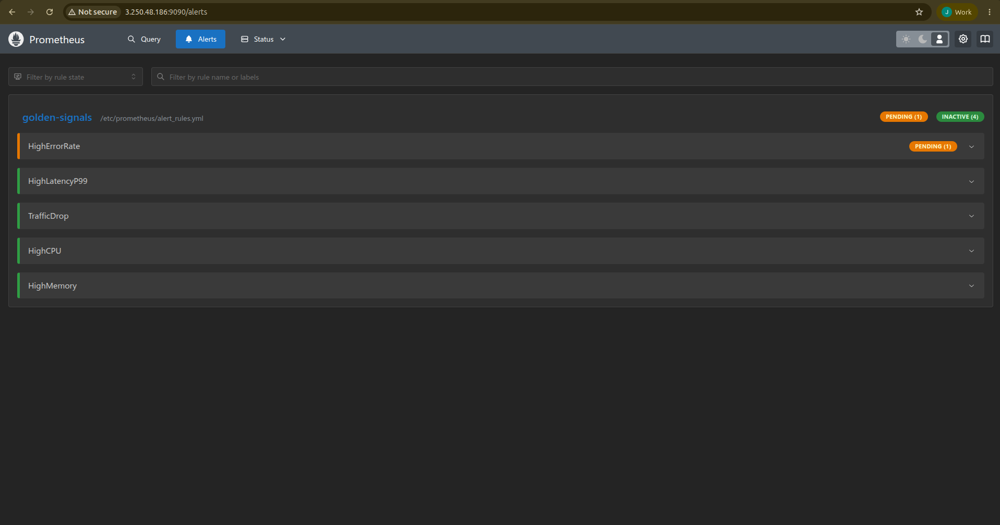

…and is delivered to the `remediation` receiver in AlertManager
(`severity=critical`, `signal=errors`).

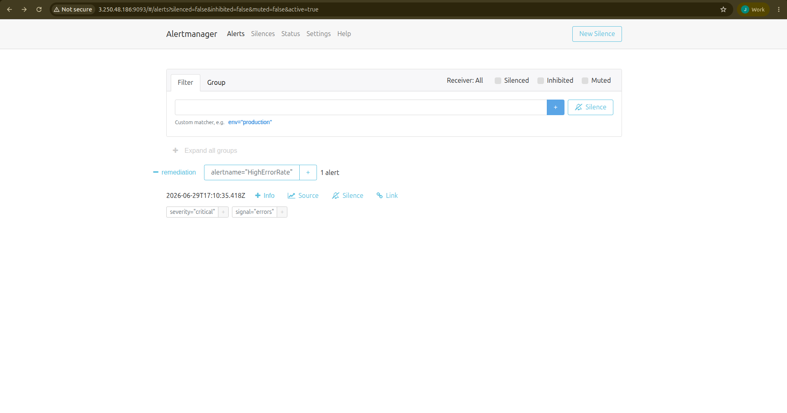

The remediation service acts: `POST /chaos/reset → 200` and the app is
restarted (visible on the control panel's probe log + event timeline).

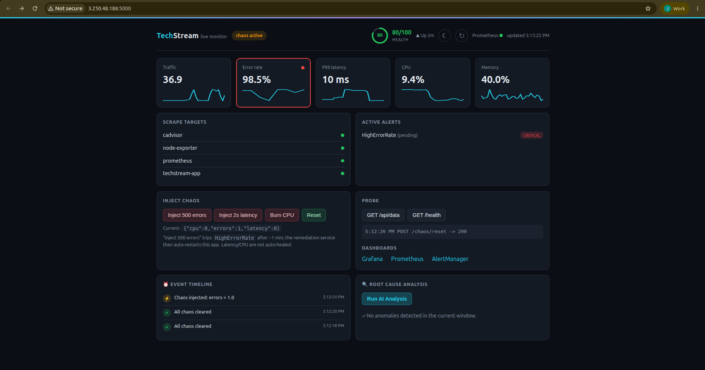

**Recovery:** the error rate returns to 0%, chaos clears, and the app is back
**UP** — the full detect → alert → heal loop, automatically.


### Phase 4 — AI / statistical root-cause analysis

The stdlib analyzer (Z-score + IQR) flags the anomalous signals, builds a causal
chain, and names the likely root cause — surfaced directly in the control panel.

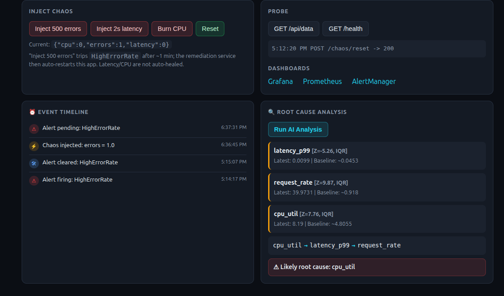

The optional LLM RCA turns those findings into a written report:
[assets/rca_report.md](assets/rca_report.md).

### CI/CD & Infrastructure

| CI (lint, tests, image build, terraform validate) | CD (deploy via SSM) | Instance SSM-managed |
|---|---|---|
| 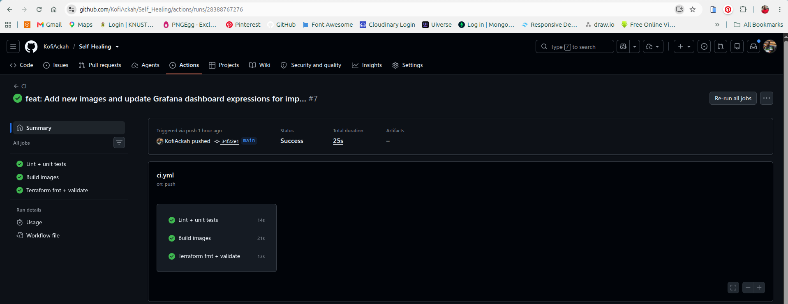 | 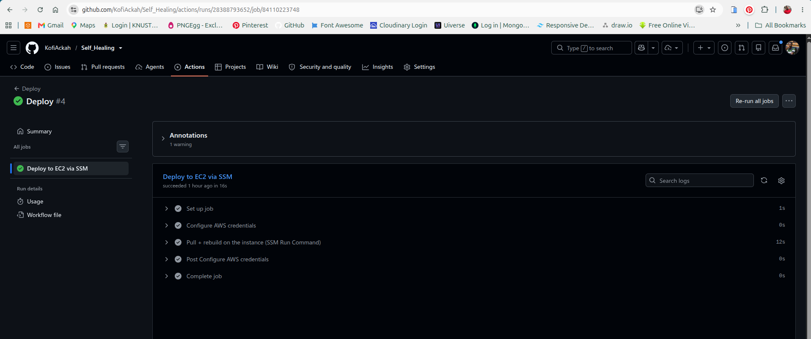 | 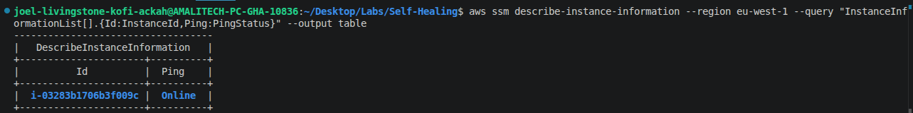 |

---

## Quick start (local)

```bash
cp .env.example .env          # set REMEDIATION_TOKEN + GF_SECURITY_ADMIN_PASSWORD
scripts/deploy_local.sh       # build + start the 8-service stack
scripts/run_demo.sh           # inject errors → watch it self-heal → RCA
scripts/cleanup.sh            # tear down
```

Endpoints (lock to your IP): app `:5000`, Prometheus `:9090`,
AlertManager `:9093`, Grafana `:3000`.

## Deploying to AWS

1. **Create the Terraform state bucket** (one-time, in the lab account):

   ```bash
   nsp                              # switch to the lab account
   ACCOUNT=$(aws sts get-caller-identity --query Account --output text)
   BUCKET=techstream-selfhealing-tfstate-$ACCOUNT
   aws s3api create-bucket --bucket "$BUCKET" --region eu-west-1 \
     --create-bucket-configuration LocationConstraint=eu-west-1
   aws s3api put-bucket-versioning --bucket "$BUCKET" \
     --versioning-configuration Status=Enabled
   ```

   Put `$BUCKET` into [terraform/backend.tf](terraform/backend.tf) (S3 native
   locking via `use_lockfile` — no DynamoDB needed).

2. **Store the Anthropic key in SSM** (optional — only for the Claude RCA bonus):

   ```bash
   aws ssm put-parameter --name /techstream/anthropic_api_key \
     --type SecureString --value "sk-ant-..." --region eu-west-1
   ```

3. **Provision the instance:**

   ```bash
   cd terraform
   cp terraform.tfvars.example terraform.tfvars   # set my_ip_cidr + key_name
   terraform init
   terraform apply
   ```

   > The security group is locked to `my_ip_cidr` (a single `/32`). If you
   > change networks your public IP changes — update `my_ip_cidr` and
   > `terraform apply` again to regain access.

4. Clone the repo on the box, create `.env`, run `scripts/deploy_local.sh`. On
   the instance, source the key from SSM rather than `.env`:

   ```bash
   export ANTHROPIC_API_KEY=$(aws ssm get-parameter \
     --name /techstream/anthropic_api_key --with-decryption \
     --query Parameter.Value --output text)
   ```

## Continuous deployment (CD)

[.github/workflows/deploy.yml](.github/workflows/deploy.yml) auto-deploys to the
EC2 **after CI passes on `main`**. It uses **AWS SSM Run Command** — not SSH — so
the security group stays locked to a single IP (GitHub's runners never connect to
the instance). The deploy step runs, as `ec2-user`:

```
cd ~/Self-Healing && git pull --ff-only origin main && bash scripts/deploy_local.sh
```

**One-time setup:**

1. **Grant the instance SSM access** — already in Terraform; apply it:
   ```bash
   cd terraform && terraform apply    # attaches AmazonSSMManagedInstanceCore
   ```
   The SSM agent ships with AL2023; the instance registers within ~2 min.
2. **Clone the repo on the EC2** at `~/Self-Healing` with a valid `.env`.
3. **Add GitHub repo secrets** (Settings → Secrets and variables → Actions):
   | Secret | Value |
   |---|---|
   | `AWS_ACCESS_KEY_ID` / `AWS_SECRET_ACCESS_KEY` | credentials that can call SSM |
   | `AWS_REGION` | `eu-west-1` |
   | `EC2_INSTANCE_ID` | the instance id |

> **Security:** prefer a dedicated CI principal over personal keys — either
> GitHub OIDC (no long-lived keys) or an IAM user scoped to just
> `ssm:SendCommand` + `ssm:GetCommandInvocation` on this instance. Don't create
> the access key in Terraform (it would land in state).

## AI / root-cause analysis (Phase 4)

Three options, in order of dependency weight:

| Tool | Engine | Needs |
|------|--------|-------|
| [ai_analysis/root_cause_analyzer.py](ai_analysis/root_cause_analyzer.py) | Z-score + IQR (**stdlib only**) | nothing — this is the primary deliverable |
| [ai_analysis/analyze.py](ai_analysis/analyze.py) | Claude API (bonus) | `anthropic` + `ANTHROPIC_API_KEY` |
| [ai_analysis/analyze_gemini.py](ai_analysis/analyze_gemini.py) | Gemini API (bonus) | `google-genai` + `GEMINI_API_KEY` |

The statistical analyzer pulls the Golden-Signal series from Prometheus, flags
anomalies via Z-score **and** IQR, orders them into a causal chain, and names the
likely root cause. The LLM variants reuse that exact analysis and turn it into a
written RCA report — they are strictly **bonus**; the lab is fully satisfied by
the stdlib analyzer (no external API required).

```bash
# primary (stdlib, no key) — run during an active incident:
python3 ai_analysis/root_cause_analyzer.py --prometheus http://<host>:9090

# bonus — Gemini (free key from https://aistudio.google.com):
pip install -r ai_analysis/requirements.txt
export GEMINI_API_KEY=...
python3 ai_analysis/analyze_gemini.py --prometheus http://<host>:9090 --output rca_report.md
```

> Run any analyzer **while the incident is live** (or within its 15-min window).
> The self-heal resets the fault ~90s after errors start, so the elevated signals
> must still be in the window for an anomaly to be detected.

## Testing

```bash
pip install -r tests/requirements.txt
pytest                       # unit tests (app, chaos, analyzer, remediation)
RUN_E2E=1 pytest tests/test_integration_e2e.py   # live end-to-end (stack up)
```

CI ([.github/workflows/ci.yml](.github/workflows/ci.yml)) runs ruff, the unit
tests, both Docker image builds, and `terraform validate` on every push/PR.

## Security notes

- The remediation webhook is **bearer-token authenticated**; it is not an open
  restart endpoint.
- The remediation service reaches Docker through a **socket proxy limited to
  container restart**, never the raw `/var/run/docker.sock`.
- The IAM instance role can read **only** the one SSM parameter (least
  privilege) and is SSM-managed for CD; IMDSv2 is required on the instance.
- All secrets live in `.env` / SSM (gitignored / encrypted); the security group
  is locked to a single IP.

See [LAB_REPORT.md](LAB_REPORT.md) for the full write-up.
